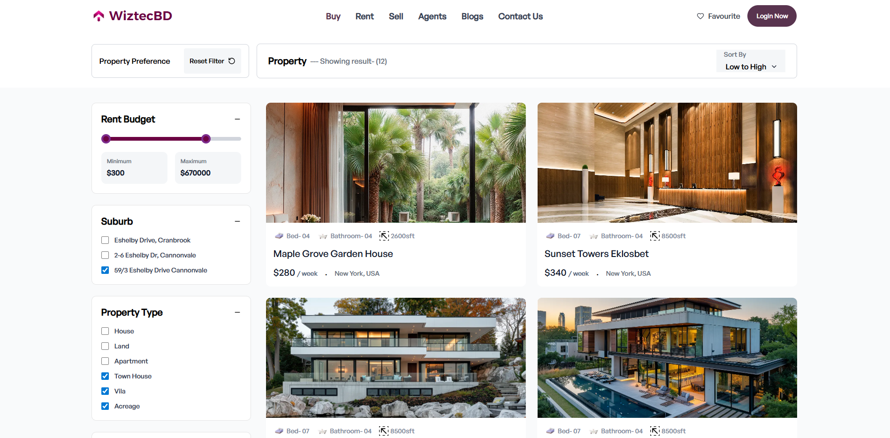

# WizardTech

A modern property marketplace platform built with Next.js 15, featuring a beautiful UI with property listings, testimonials, educational resources, and essential tools for property management.



## Live Link

https://wizardtech.vercel.app

## ✨ Features

-  **Property Marketplace** - Browse and filter properties with an intuitive grid layout
-  **Property Details** - Detailed property views with modal and sidebar components
-  **Revenue Section** - Educational courses and trusted partner showcase
-  **Testimonials** - Customer reviews and success stories
-  **Essential Tools** - Property management and analytics tools
-  **Responsive Design** - Mobile-first approach with Tailwind CSS
-  **Modern UI Components** - Built with shadcn/ui

## 🚀 Tech Stack

-  **Framework:** [Next.js 15](https://nextjs.org) with App Router
-  **Language:** TypeScript
-  **Styling:** Tailwind CSS 4
-  **UI Components:**
   -  shadcn/ui components
   -  Lucide icons
-  **Animations:** tw-animate-css
-  **Build Tool:** Turbopack

## 📦 Getting Started

### Prerequisites

-  Node.js 20+
-  npm, yarn, pnpm, or bun

### Installation

1. Clone the repository:

```bash
git clone https://github.com/aktaruzzamanjoti97/wizardtech
cd wizardtech
```

2. Install dependencies:

```bash
npm install
```

3. Run the development server:

```bash
npm run dev
```

4. Open [http://localhost:3000](http://localhost:3000) in your browser

### Available Scripts

```bash
npm run dev      # Start development server with Turbopack
npm run build    # Build for production with Turbopack
npm run start    # Start production server
npm run lint     # Run ESLint
```

## 📁 Project Structure

```
wizardtech/
├── src/
│   ├── app/              # Next.js app directory
│   │   ├── page.tsx      # Home page
│   │   ├── login/        # Login page
│   │   └── layout.tsx    # Root layout
│   └── components/       # React components
│       ├── ui/           # shadcn/ui components
│       ├── sections/     # Page sections
│       ├── Header.tsx
│       ├── Footer.tsx
│       ├── HeroSection.tsx
│       ├── PropertyGrid.tsx
│       ├── PropertyFilter.tsx
│       ├── RevenueSection.tsx
│       ├── TestimonialSection.tsx
│       └── EssentialToolsSection.tsx
├── public/               # Static assets
└── package.json
```

## 🎨 UI Components

This project uses [shadcn/ui](https://ui.shadcn.com/) components including:

-  Button
-  Card
-  Input
-  Separator

Custom components are organized in the `src/components` directory with dedicated sections for complex features.

## 🔧 Configuration

-  **TypeScript:** `tsconfig.json`
-  **Tailwind CSS:** `postcss.config.mjs`
-  **Next.js:** `next.config.ts`
-  **ESLint:** `eslint.config.mjs`
-  **Components:** `components.json`

## 🚢 Deployment

### Deploy on Vercel

The easiest way to deploy this Next.js app is using [Vercel](https://vercel.com/new):

[](https://vercel.com/new/clone?repository-url=https://github.com/yourusername/wizardtech)

For detailed deployment instructions, check out the [Next.js deployment documentation](https://nextjs.org/docs/app/building-your-application/deploying).

## 📚 Learn More

-  [Next.js Documentation](https://nextjs.org/docs) - Learn about Next.js features and API
-  [Next.js Tutorial](https://nextjs.org/learn) - Interactive Next.js tutorial
-  [Tailwind CSS](https://tailwindcss.com/docs) - Utility-first CSS framework

## 📄 License

This project is private and not open source.

## 🤝 Contributing

Contributions, issues, and feature requests are welcome!

---

Built with ❤️ using Next.js 15 and TypeScript
